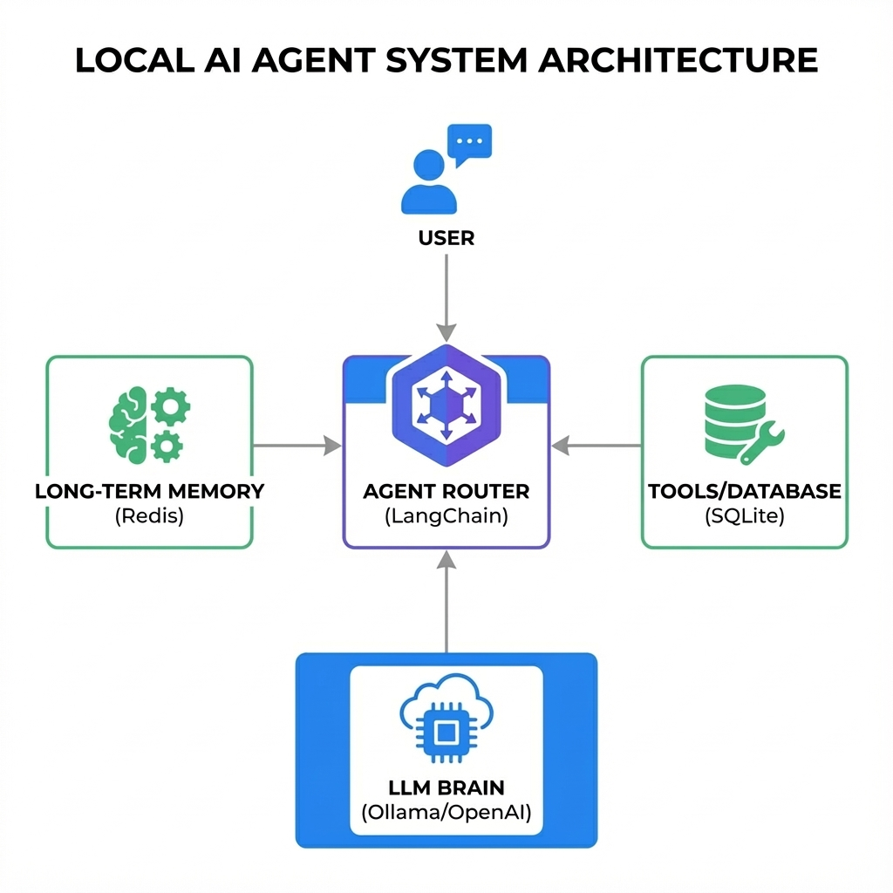
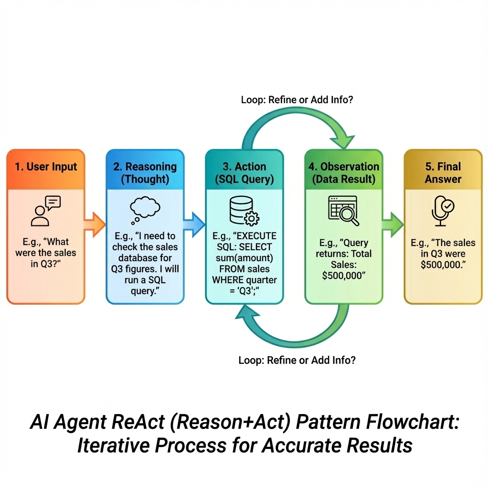

# Agent Core



## Local AI Orchestration & Reasoning Engine

<div align="center">


</div>

**Agent Core** turns static LLMs into autonomous agents. It implements the **ReAct (Reason + Act)** pattern to allow local models (running via Ollama) to use Tools, query Databases, and maintain long-term Memory (Redis) without sending data to the cloud.

---

## 🚀 Quick Start

Run the Agent locally:

```bash
# 1. Start Support Services
docker-compose up -d

# 2. Run Reasoning Loop
pip install -r requirements.txt
python main.py
```

> **Note**: Requires [Ollama](https://ollama.com/) running on port 11434.

---

## 📸 Architecture & Logic

### The Reasoning Loop (ReAct)

*Input -> Thought -> Action -> Observation -> Final Answer*

### System Data Flow

*Router dispatching User Intent to Tools and Memory*

> **Deep Dive**: See [ARCHITECTURE.md](./docs/ARCHITECTURE.md) for the Prompt Engineering strategy.

---

## ✨ Key Features

*   **🧠 ReAct Pattern**: Implements "Thought-Action-Observation" loops for complex problem solving.
*   **🔌 Tool Use**: Can execute Python functions (Calculator, Search, API Calls).
*   **🔒 100% Local**: Works with Llama 3 / Mistral via Ollama. No OpenAI keys required.
*   **💾 Redis Memory**: Persistent conversation context across sessions.

---

## 📚 Documentation

| Document | Description |
| :--- | :--- |
| [**System Architecture**](./docs/ARCHITECTURE.md) | Chain-of-Thought and ReAct Logic. |
| [**Getting Started**](./docs/GETTING_STARTED.md) | Setup Guide for Ollama and Python. |
| [**Failure Scenarios**](./docs/FAILURE_SCENARIOS.md) | Handling Infinite Loops and Hallucinations. |
| [**Interview Q&A**](./docs/INTERVIEW_QA.md) | "Why ReAct?" and "Local vs Cloud LLMs". |

---

## 🔧 Tech Stack

| Component | Technology | Role |
| :--- | :--- | :--- |
| **Model** | **Ollama (Llama 3)** | Inference Engine. |
| **Logic** | **LangChain** | Agent Orchestration. |
| **Memory** | **Redis** | Context Storage. |
| **Runtime** | **Python 3.11** | Application Logic. |

---

## 👤 Author

**Harshan Aiyappa**  
Senior Full-Stack Engineer  
[GitHub Profile](https://github.com/Kimosabey)

---

## 📝 License

This project is licensed under the MIT License - see the [LICENSE](LICENSE) file for details.
