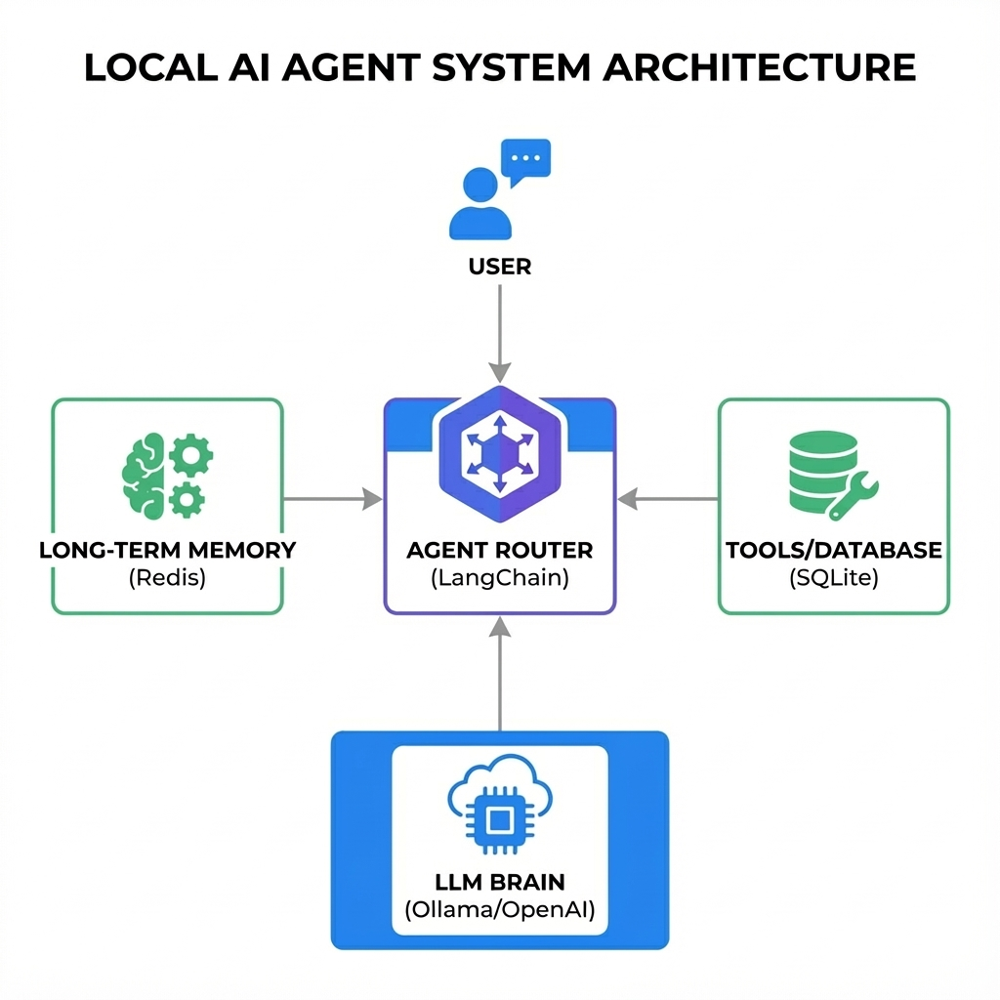
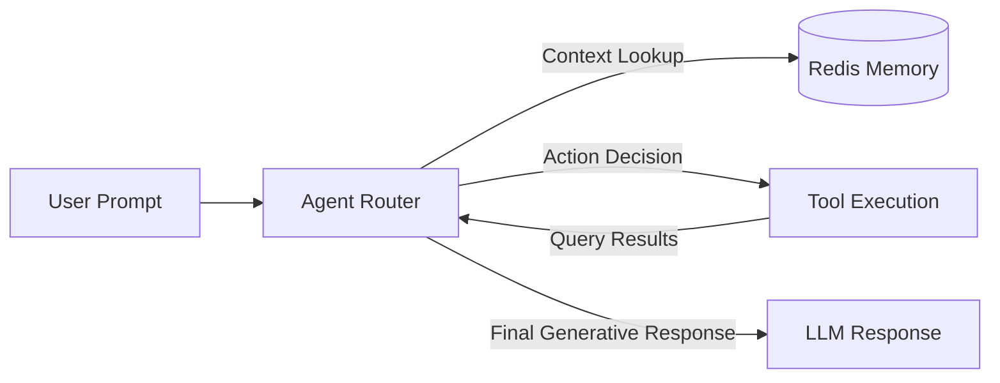
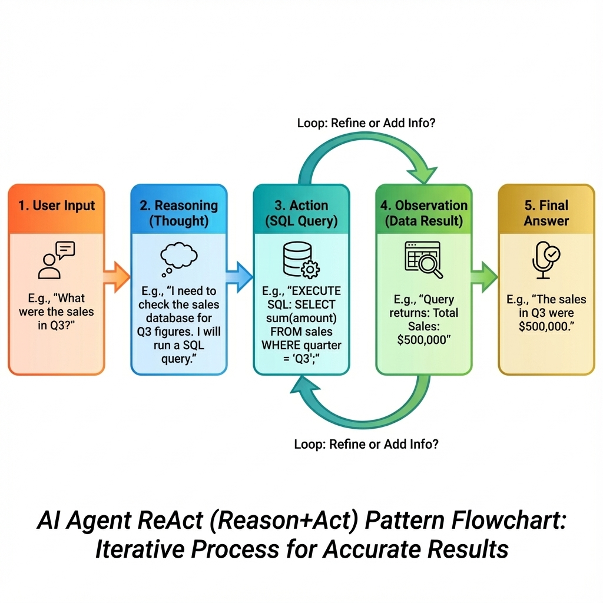

# Local AI Agent (A2) - Agentic AI Orchestration

## 🚀 Phase 3: The Agentic Layer

**Objective:** Build an autonomous LLM agent capable of reasoning, using tools (database queries), and maintaining conversational context.

### 🛠️ Tech Stack
- **LangChain**: Orchestration framework for ReAct pattern and tool management.
- **Ollama**: Local LLM runner (hosting models like Llama 3 or Mistral).
- **Redis**: Fast, persistent memory store for conversation history.
- **Python**: Core application logic.

### 🔄 Data Flow

```mermaid
graph LR
    User[User Prompt] --> Router[Agent Router]
    Router -->|Context Lookup| Redis[(Redis Memory)]
    Router -->|Action Decision| Tools[Tool Execution]
    Tools -->|Query Results| Router
    Router -->|Final Generative Response| LLM[LLM Response]
```

### 📋 Features
1.  **ReAct Pattern**: Reason + Act loops to solve complex queries.
2.  **Tool Use**: capabilities to interact with external systems (mock database for now).
3.  **Context Awareness**: Remembers previous turns of conversation via Redis.

### 🏃‍♂️ Running the Project
1.  Ensure **Ollama** is running locally (`ollama serve`).
2.  Ensure **Redis** is running (Docker or local install).
3.  Install dependencies: `pip install -r requirements.txt`
4.  Run the agent: `python main.py`

---

## 📚 Documentation

- [Architecture Guide](./docs/ARCHITECTURE.md) - System design and patterns

---

## 👤 Author

**Harshan Aiyappa**

- GitHub: [@Kimosabey](https://github.com/Kimosabey)

