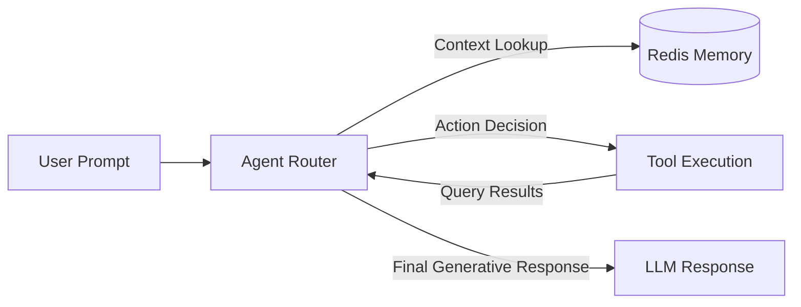

# Local AI Agent (A2)
## Agentic AI Orchestration Layer

<div align="center">


**Tech Stack**


**Features**


</div>

---

## 🚀 Quick Start

### 1. Prerequisites
- **Ollama** (Running locally with `llama3` or `mistral`)
- **Redis** (Docker or Local)
- **Python 3.10+**

### 2. Installation
```bash
git clone <your-repo>
cd agent-core
pip install -r requirements.txt
```

### 3. Run Agent
```bash
# Ensure Ollama & Redis are up
python main.py
```

---

## 📸 Visual Overview

### System Data Flow

*Flow of prompts through Router, Memory, and Tools*

### ReAct Pattern Logic

*Reason-Act loops for solving complex queries*

---

## ✨ Key Features

### 🧠 Autonomous Reasoning
- **ReAct Pattern**: Implements "Reason + Act" loops to decompose complex user queries into actionable steps.
- **Chain-of-Thought**: Maintains internal monologue to guide decision-making.

### 🛠️ Tool Orchestration
- **Function Calling**: Capable of executing specific python functions (mock DB queries, calculations).
- **Dynamic Selection**: Router selects the best tool for the job.

### 🧠 Persistent Memory
- **Context Awareness**: Uses Redis to store conversation history, allowing for multi-turn dialogue with context retention.

---

## 🏗️ Architecture


```mermaid
graph LR
    User[User Prompt] --> Router[Agent Router]
    Router -->|Context Lookup| Redis[(Redis Memory)]
    Router -->|Action Decision| Tools[Tool Execution]
    Tools -->|Query Results| Router
    Router -->|Final Generative Response| LLM[LLM Response]
```

---

## 🔧 Tech Stack

| Component | Technology | Purpose |
| :--- | :--- | :--- |
| **Logic** | Python | Core application runtime |
| **Framework** | LangChain | Agent orchestration & prompts |
| **LLM** | Ollama | Local inference runner |
| **Memory** | Redis | Vector/Conversation store |

---

## 📚 Documentation

- [**Architecture Guide**](./docs/ARCHITECTURE.md) - System design and patterns

---

## 📝 License

MIT License - See [LICENSE](./LICENSE) for details

---

## 👤 Author

**Harshan Aiyappa**  
Senior Full-Stack Engineer  
📧 [GitHub](https://github.com/Kimosabey)

---

**Built with**: Python • LangChain • Ollama • Redis
