# 🏗️ System Architecture

## 1. High-Level Design (HLD)

Agent Core is a **Local Reasoning Engine** built on the ReAct (Reason + Act) pattern. It serves as an autonomous decision-making layer that sits between the User and Raw LLMs (like Llama 3), turning simple text completion engines into goal-seeking agents.

```mermaid
graph TD
    User([👤 User]) -->|Goal| Agent[🤖 Agent Core]
    
    subgraph "Reasoning Loop"
        Agent -->|1. Thought| Brain[Llama 3 Local]
        Brain -->|2. Action Plan| Agent
        Agent -->|3. Toolkit| Tools[🛠️ Calculator / Search / DB]
        Tools -->|4. Observation| Agent
        Agent -->|5. Synthesis| Memory[(Redis Context)]
    end
    
    Memory -->|History| Brain
    Agent -->|Final Answer| User
```



### Core Components
1.  **Agent Router**: The central dispatcher that parses the User's intent.
2.  **Tool Registry**: A modular collection of Python functions (e.g., `calculate_tax`, `search_kb`) that the LLM can "call".
3.  **Redis Memory**: Long-term conversational storage preventing the agent from "forgetting" instructions.
4.  **Local Inference**: Ollama running quantized models (Llama 3 8B) for privacy and speed.

---

## 2. Low-Level Design (LLD)

### The ReAct Loop
Instead of standard "Input -> Output", Agent Core uses "Input -> Thought -> Action -> Observation -> Output".

1.  **Thought**: "The user wants to know the square root of their account balance."
2.  **Action**: `call_tool('get_balance', user_id='123')`
3.  **Observation**: "Balance is 100."
4.  **Thought**: "Now I need to calculate sqrt(100)."
5.  **Action**: `call_tool('calculator', expression='sqrt(100)')`
6.  **Observation**: "10."
7.  **Final Answer**: "Your result is 10."

### Prompt Engineering
We inject a meta-prompt (System Message) that enforces strict structured output (JSON) for tool calling, preventing the LLM from rambling.

```python
SYSTEM_PROMPT = """
You are an autonomous agent. 
To use a tool, please output a JSON object:
{ "tool": "search", "args": { "query": "weather" } }
Do not execute the tool yourself. Just ask to run it.
"""
```

---

## 3. Decision Log

| Decision | Alternative | Reason for Choice |
| :--- | :--- | :--- |
| **LangChain** | Raw OpenAI API | **Abstraction**. LangChain provides built-in parsers for ReAct loops, making it easier to swap models (e.g., upgrading from Llama 2 to 3) without rewriting regex parsers. |
| **Ollama** | HuggingFace Transformers | **UX**. Ollama exposes a clean REST API, avoiding the need to manage PyTorch weights and CUDA dependencies manually in the Python code. |
| **Redis** | In-Memory List | **Persistence**. Allows the agent to be restarted without losing the "Memory" of the conversation. |

---

## 4. Key Patterns

### Tool Use (Function Calling)
The defining feature of this agent is **Agency**. It is not passive. It has write-access to the outside world via Tools. This transforms the LLM from a "Chatbot" into an "Operator".

### Chain-of-Thought (CoT)
We effectively force the model to "show its work". This improves accuracy on math and logic tasks by 40-50% compared to zero-shot answers, as the model generates intermediate tokens to stabilize its reasoning track.
